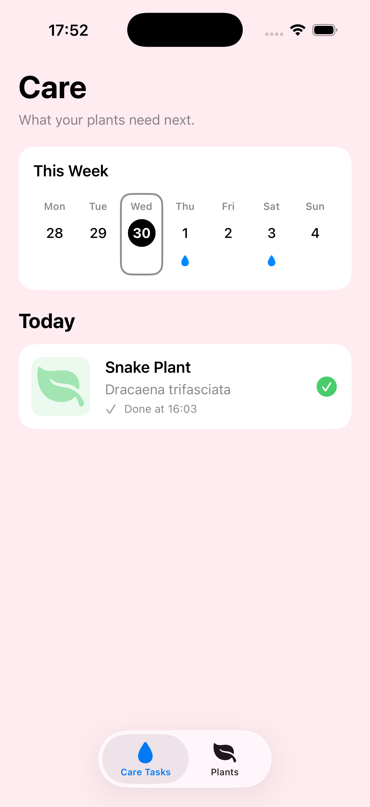
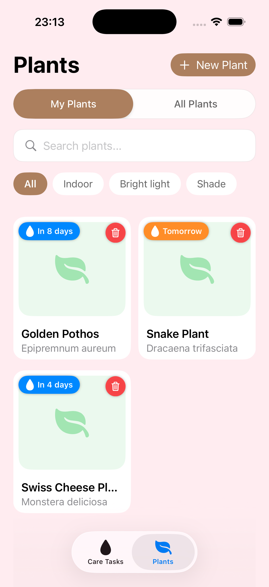
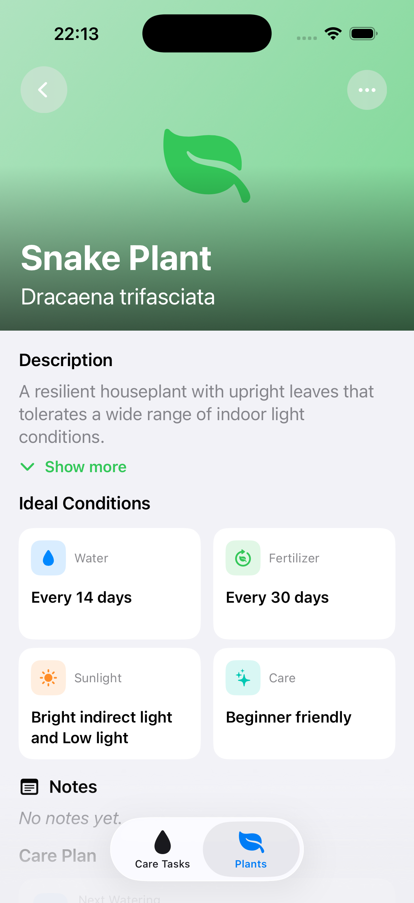

# Beanji - iOS Plant Care App


Beanji is a local-first iOS plant-care application for people who want a simple overview of their plants and recurring care routines. It combines an offline plant catalog with personal care schedules and persistent watering history.

> **Project status:** This repository represents the stable public foundation of an app that is still being developed toward production. The portfolio catalog is intentionally limited to three example plants.


## Features

- Browse and search a validated offline plant catalog.
- Add catalog plants or create personal plants manually.
- Edit plant details and individual watering and fertilizing intervals.
- Select a day in the weekly calendar to view upcoming watering tasks, while Today keeps overdue, due-today, and completed tasks together.
- Persist completed watering actions and automatically recalculate the next due date.

Beanji works offline and does not require an account, backend, or API key.

## Screenshots

| Care schedule | Plant collection | Plant details |
| --- | --- | --- |
|  |  |  |

## Architecture and Data 

Beanji follows pragmatic MVVM with repository boundaries around persistence and catalog access.

```text
SwiftUI Views
    ↓
Observable MainActor ViewModels
    ↓
Repository and provider protocols
    ↓
SwiftData persistence / bundled JSON catalog
```

Key architectural decisions:

- Views render observable state while ViewModels coordinate feature behavior.
- Repository protocols keep SwiftData and catalog access outside the UI.
- In-memory repository implementations support previews and focused tests.
- Shared domain logic calculates watering and fertilizing schedules independently from SwiftUI.
- Completing a watering task updates the plant and persists a care event in one repository operation.
- Optional remote enrichment remains isolated and is not part of the current app flow.

Personal plants and completed care events are stored locally with SwiftData. The bundled `houseplants.json` catalog uses a Beanji-specific schema and is decoded and validated before its entries reach the UI.

## Requirements

- Xcode 26.6 or newer
- iOS 26.5 or newer
- An available iOS simulator or compatible device

The project has no external package dependencies.

## Getting started

```bash
git clone https://github.com/eugeniaFan/Beanji-MobileApp.git
cd Beanji-MobileApp
open Beanji/Beanji.xcodeproj
```

Select the `Beanji` scheme and run the app with `Command + R`. 
No additional configuration is required.

## Testing

The unit test suite covers:

- Bundled catalog decoding, validation, and metadata mapping
- Local search and explicit remote-enrichment behavior
- Manual plant creation, editing, and catalog-specific detail behavior
- Watering and fertilizing schedule calculations
- Care-calendar day selection, empty states, completion, and error handling
- SwiftData care-event persistence and atomic watering updates

UI coverage includes launch checks, launch performance measurement, and one focused manual Add Plant flow.

Run the complete test suite in Xcode with `Command + U`, or use an installed simulator:

```bash
xcodebuild \
  -project Beanji/Beanji.xcodeproj \
  -scheme Beanji \
  -destination 'platform=iOS Simulator,name=iPhone 17 Pro' \
  test
```

Replace the simulator name with one available in the local Xcode installation.

## Localization and accessibility

Beanji supports English and German through a String Catalog and follows the standard iOS per-app language setting.

Key icon-only controls and combined care information include localized accessibility labels for assistive technologies such as VoiceOver. Decorative images are hidden from accessibility when adjacent text already provides the same information.

## Privacy

The current version stores personal plant and care data locally on the device. It does not require an account or backend and does not transmit personal plant data.

## License

Copyright © 2026 Eugenia Fanenstiel. All rights reserved.

This repository is published for portfolio and evaluation purposes. No open-source license is granted. Use, modification, or redistribution of the source code and bundled content requires prior written permission, except where permitted by applicable law or GitHub's Terms of Service.
